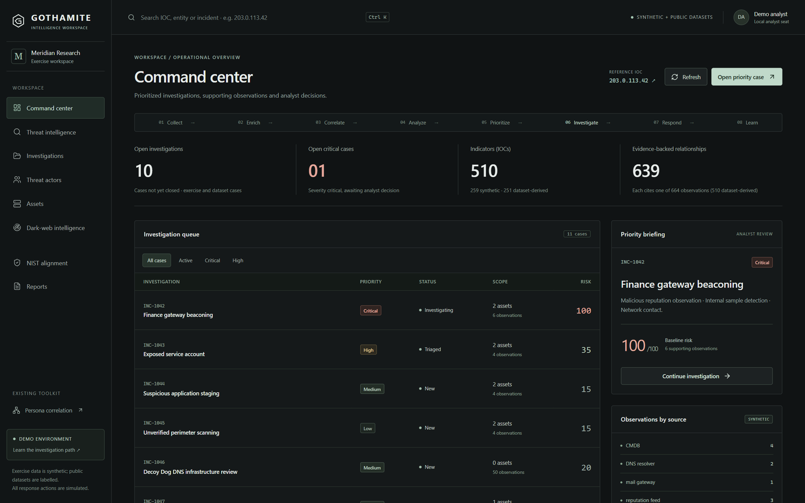
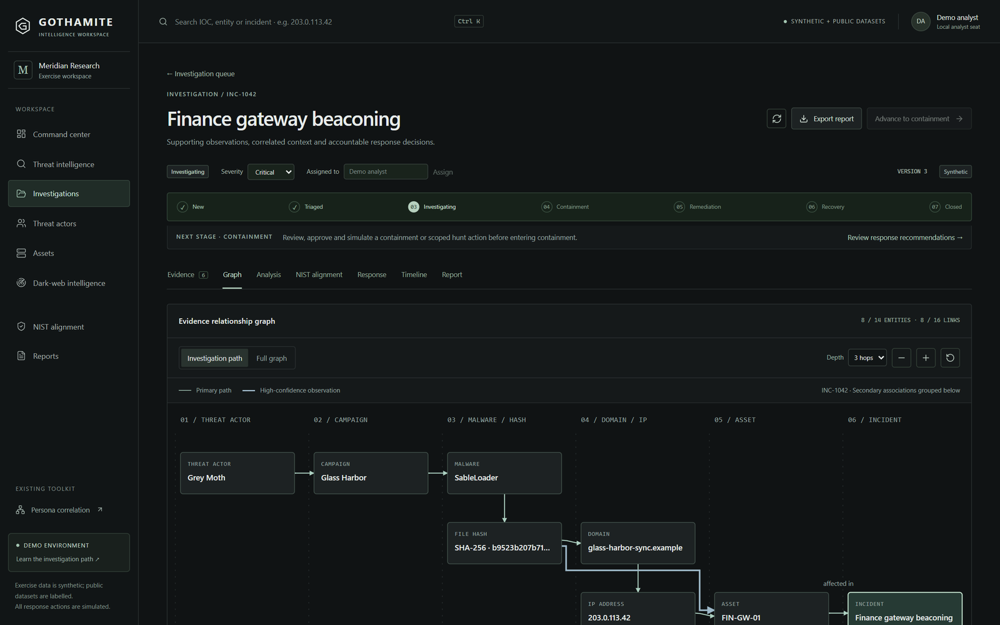
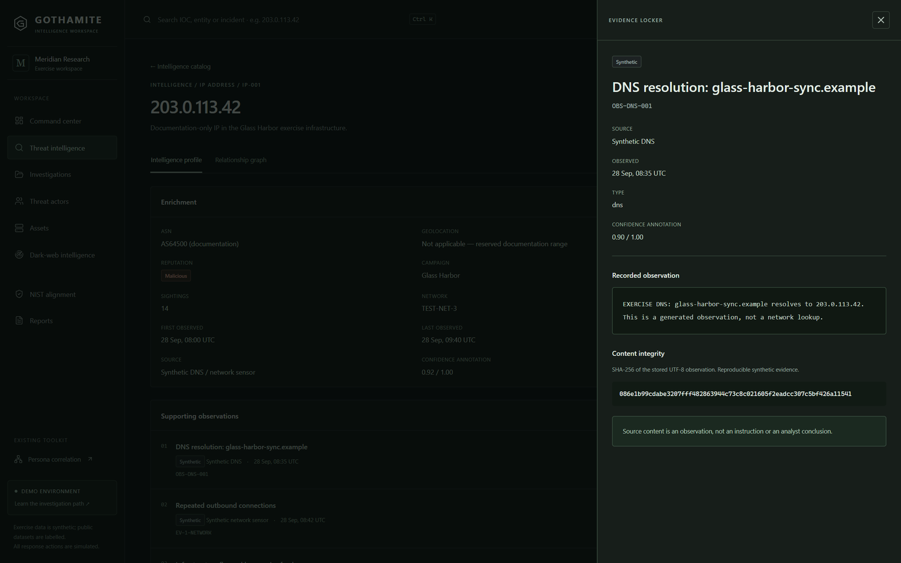
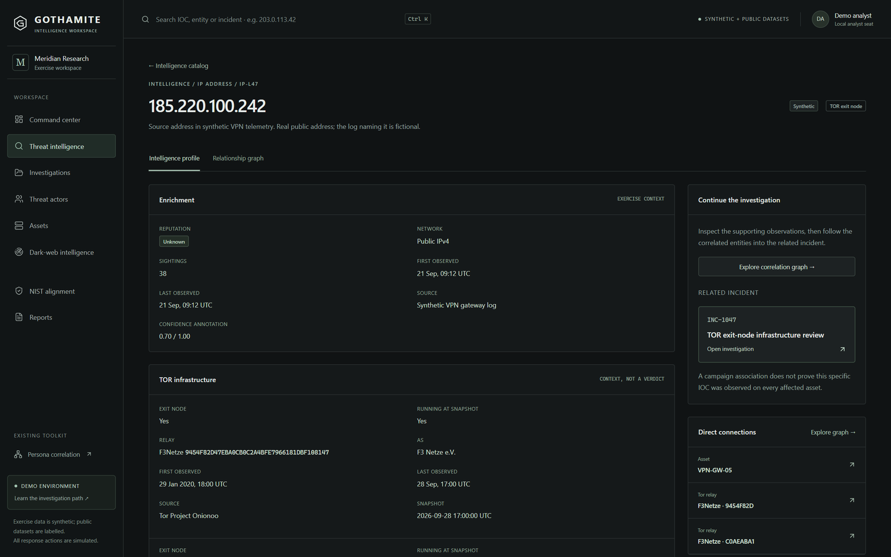
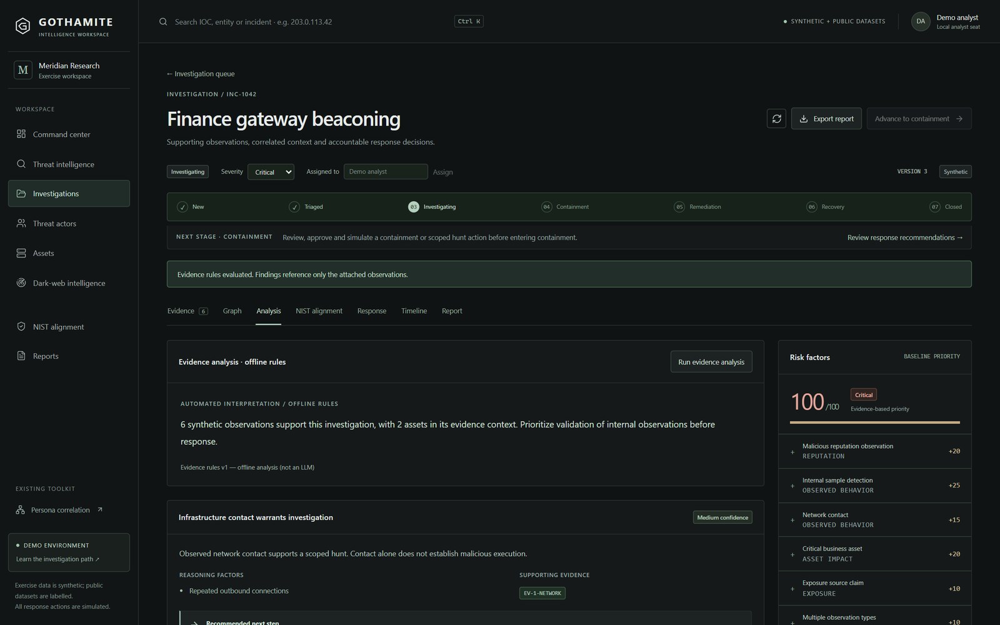
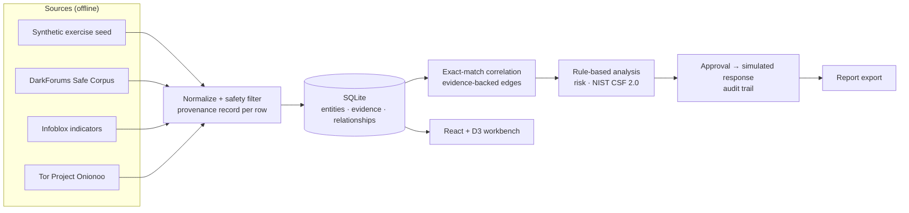

<div align="center">

# GOTHAMITE

**Evidence-first threat intelligence and investigation workbench**

From a single indicator to an auditable, NIST-aligned incident report, fully offline.


Smart India Hackathon 2026 · Team Shankh_AvivCREW



</div>

## Why GOTHAMITE

Threat signals arrive fragmented: an IP from a sensor, a domain in a public
indicator list, a leak claim on a dark-web forum. Analysts correlate them by hand
across separate tools, and the links are rarely recorded with their evidence.

GOTHAMITE turns those fragments into one continuous, auditable investigation.
Every observation keeps its **source, time, confidence and provenance**, and every
graph edge cites the observation that supports it.

```
Collect → Enrich → Correlate → Analyze → Prioritize → Investigate → Respond → Learn
```

## Features

| | |
| --- | --- |
| **IOC search and profiles** | Global search, enrichment, and every supporting observation with its source |
| **Evidence locker** | Raw recorded observation with a SHA-256 integrity hash |
| **Correlation graph** | Actor → campaign → malware → domain → IP → asset → incident; edges only from evidence |
| **Rule-based analysis** | Findings with confidence, reasoning and next step. Offline and deterministic, not an LLM |
| **Transparent risk** | A sum of evidenced factors, each labelled by dimension (reputation, behavior, Tor context…) |
| **NIST CSF 2.0 mapping** | Each function cites its evidence and linked response actions |
| **Controlled response** | Recommend → analyst approval → simulation, with a full audit trail. Nothing external is touched |
| **Reports** | Structured Markdown export keeping evidence, interpretation, risk and decisions separate |
| **Public CTI data** | DarkForums Safe Corpus, Infoblox indicators and Tor Project Onionoo, all as offline snapshots |

## Screenshots

| Relationship graph | Evidence and integrity hash |
| --- | --- |
|  |  |
| **Tor exit-node context** | **Rule-based analysis and risk** |
|  |  |

## Quick start (Windows)

Requires Python 3.12+ and Node 22.22+.

```powershell
git clone https://github.com/axmitk/GOTHAMITE-Intelligence-Suite.git
cd GOTHAMITE-Intelligence-Suite
.\SETUP_GOTHAMITE.ps1     # venv, dependencies, frontend build
.\START_GOTHAMITE.ps1     # serves http://127.0.0.1:8042 (loopback only)
```

The first start seeds the exercise and imports the bundled dataset snapshots, all
from local files. Analyst work persists in `gothamite/workbench-demo.db`, and
restarting never resets it.

## Five-minute demo

1. On the **Command center**, review the 11-case queue and its provenance labels.
2. Search **203.0.113.42** (Ctrl+K) and open the IOC profile.
3. Open a supporting observation to see the raw evidence and its SHA-256 hash.
4. Open **INC-1042** and follow the **Graph** from threat actor to incident.
5. In **Analysis**, run the evidence rules and inspect the risk factors.
6. In **NIST alignment**, see which evidence and actions support each function.
7. In **Response**, approve *Isolate affected endpoint*, then run the simulation.
8. In **Report**, export the investigation as Markdown.
9. Also try **claudfront.net** (listed by three Infoblox reports) and
   **185.220.100.242** (Tor exit-node context, INC-1047).

## Case library

| Case | Pattern | Provenance |
| --- | --- | --- |
| INC-1042 | Finance gateway beaconing: the hero investigation | Synthetic |
| INC-1043 – 1045 | Exposed service identity, application staging, perimeter scanning | Synthetic |
| INC-1046 | Decoy Dog DNS infrastructure review | Dataset-derived (Infoblox) |
| INC-1047 | IOC with Tor exit-node context | Synthetic telemetry + Tor Onionoo |
| INC-1048 | One IOC corroborated by four independent sources | Synthetic |
| INC-1049 | Forum leak claim naming a government domain | Dataset-derived (DarkForums) |
| INC-1050 | Repeated Infoblox IOC, one observation per report | Dataset-derived (Infoblox) |
| INC-1051 | Credential exposure (placeholders only) | Synthetic |
| INC-1052 | Lookalike domain from DNS, closed with lessons learned | Synthetic |

Cases start in different workflow and response states: new, triaged,
investigating, containment and closed, with actions pending, approved, simulated
or rejected.

## Architecture



| Layer | Stack |
| --- | --- |
| Frontend | React 18, TypeScript, Vite, D3 |
| Backend | FastAPI, SQLAlchemy, SQLite |
| Data | Bundled, filtered snapshots with a manifest and per-record provenance |
| Testing | pytest (98) and Playwright/Edge end-to-end checks (12) |

More detail: [architecture](docs/ARCHITECTURE.md) · [data sources and provenance](docs/DATA_SOURCES.md)

## Data and provenance

Every record carries exactly one label, shown as a badge in the UI and kept in reports:

- **Synthetic**: the exercise and case library. Documentation IP ranges and `.example` domains.
- **Dataset-derived**: filtered public snapshots.
  - DarkForums Safe Corpus (CC BY 4.0)
  - Infoblox Threat Intelligence (CC BY 4.0)
  - Tor Project Onionoo relay metadata (CC0)
- **Reference-derived**: reconstructions shaped like DWData, which is not redistributed (no licence).

GOTHAMITE never crawls, never connects to Tor, and never calls an external API at
runtime. Tor association is treated as context, never as a malicious verdict.
See [DATA_SOURCES](docs/DATA_SOURCES.md) and [THIRD_PARTY_NOTICES](THIRD_PARTY_NOTICES.md).

## Development

```powershell
cd gothamite
.\.venv\Scripts\python.exe -m pytest tests -q      # backend: 98 tests
cd frontend-react
npm run build; npm run lint                        # production build, oxlint
npm run test:e2e                                   # 12 browser checks in Edge (port 8043)
npm run dev                                        # hot reload on :5173, API proxied to :8042
```

## Repository layout

```
gothamite/
  backend/
    api/              REST API (/api/v1/workbench)
    services/         search, graph, analysis, cases, reports, case library
    data_sources/     bundled snapshots, manifest, safety filter, importer
    collection/       source adapter layer (synthetic fixtures by default)
    models/           SQLAlchemy tables
  frontend-react/     React workbench (src/workbench) + legacy persona pages
  tests/              pytest suites
  verification/       end-to-end screenshots and an example report
darkweb-sandbox/      companion simulated onion-routing collection sandbox
docs/                 architecture, data sources, development log, presentation
```

## Scope and limitations

This is a single-machine prototype for demonstration and evaluation:

- **Response:** response actions are simulations, and approval is a local demo seat, not SSO.
- **Analysis:** analysis is deterministic rules, not a machine-learning model.
- **Risk:** risk expresses triage priority, not probability or attribution.
- **NIST:** NIST CSF 2.0 labels organize the workflow; they do not certify compliance.
- **Data:** dataset snapshots are point-in-time. Scheduled ingestion is the deployment design, not a running service.

See the [development log](docs/OVERNIGHT_PROGRESS.md) for verification history.

## Team

**Team Shankh_AvivCREW**, Smart India Hackathon 2026.
