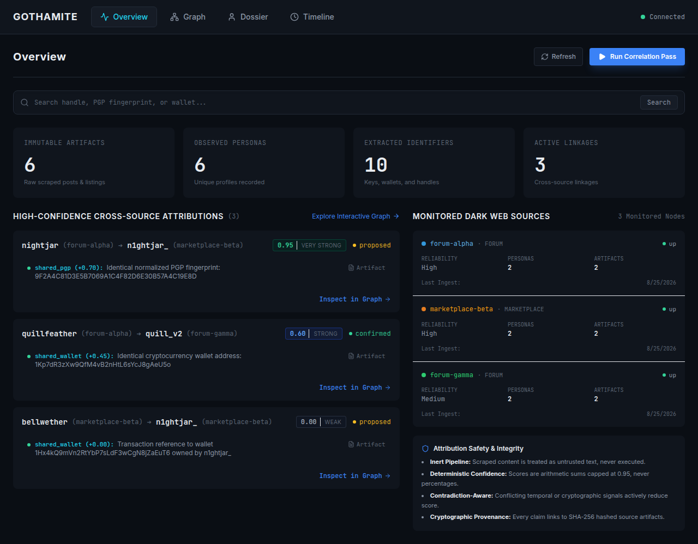

    <h1>GOTHAMITE INTELLIGENCE SUITE</h1>
    
<b>Advanced Cyber-Intelligence & Entity Resolution Platform</b>

    
    
    
      
    
An end-to-end operational intelligence platform engineered for deep-web source monitoring, multi-factor entity resolution, and LLM-powered explainable intelligence correlation.

    <a href="#architecture">Architecture</a> &bull; <a href="#nist-csf-integration">NIST CSF Integration</a> &bull; <a href="#llm-integration">LLM Analysis</a> &bull; <a href="#installation-and-deployment">Installation</a>

 

  

 

## Architecture

The GOTHAMITE platform operates on a robust data-fusion pipeline designed to minimize manual investigation time and maximize actionable intelligence. The system continuously ingests, standardizes, and infers threats from multiple external vectors.

<b>Entity Resolution & Correlation Pipeline</b>

| Pipeline Stage | Module | Technique / Technology |
|---|---|---|
| **Data Collection** | darkweb-sandbox/bridge_collector.py | Automated scraping of Web, News, Forums, Threat Feeds, and Marketplaces |
| **Integration** | ackend/services/ingest_service.py | Parsing, cleaning, and de-duplicating unstructured intelligence |
| **Standardization** | ackend/api/ingest.py | Entity linking, cross-source correlation, and confidence scoring |
| **Threat Inference** | ackend/services/llm_analysis.py | **Ollama**-powered behavior pattern analysis, summarization, and IOC extraction |
| **Output / Graph** | rontend/views/graph_view.py | Interactive Threat Graph (Neo4j / custom 3D visualization) |

 

## NIST CSF Integration

The GOTHAMITE user interface is designed as a professional cyber-intelligence workstation, operationally mapping directly to the National Institute of Standards and Technology (NIST) Cybersecurity Framework to guide analysts through a disciplined investigation cycle.

<table>
  <tr>
    <td width="20%"><b>IDENTIFY</b></td>
    <td>Asset discovery, context mapping, and threat surface identification.</td>
  </tr>
  <tr>
    <td><b>PROTECT</b></td>
    <td>Data integrity, access control, and proactive threat prioritization.</td>
  </tr>
  <tr>
    <td><b>DETECT</b></td>
    <td>Continuous threat monitoring, multi-signal correlation, and anomaly detection.</td>
  </tr>
  <tr>
    <td><b>RESPOND</b></td>
    <td>Alerts, timeline construction, and interactive graph investigation support.</td>
  </tr>
  <tr>
    <td><b>RECOVER</b></td>
    <td>Exportable dossiers, system improvement, and post-incident analysis logs.</td>
  </tr>
</table>

 

## LLM-Assisted Analysis (Ollama)

A critical component of GOTHAMITE is the **LLM-Assisted Analysis Module**, which processes raw scraped intelligence locally and securely without exposing sensitive investigation data to third-party APIs.

- **Local Model Processing**: Utilizes Ollama running local models (e.g., Llama 3) for deep-dive summarization and reasoning.
- **Threat Extraction**: Automatically extracts Indicators of Compromise (IOCs) and Tactics, Techniques, and Procedures (TTPs) from raw forum posts and pastebin dumps.
- **Stylometric Profiling**: Employs behavior pattern analysis to attribute multiple disjointed aliases to a single threat actor based on linguistic footprints.

 

## Technology Stack

- **Frontend**: Streamlit + React (Custom 3D Force Graph via Three.js)
- **Backend API**: FastAPI (Python 3.11+)
- **LLM Engine**: Ollama (Local AI Processing)
- **Graph Database**: Neo4j / NetworkX
- **Relational Store**: SQLite / PostgreSQL (SQLAlchemy ORM)
- **Deployment**: Docker + Docker Compose (Isolated microservices)

 

## Installation and Deployment

GOTHAMITE utilizes a containerized microservice architecture, allowing for isolated and reproducible deployments.

<b>Prerequisites</b> 
Ensure Docker and Docker Compose are installed on your host system. For local LLM analysis, ensure Ollama is installed and the target model is pulled (ollama run llama3).

<b>Deploying the Workstation</b> 
Navigate to the primary application directory and initialize the containers. The analyst workstation will be available at http://localhost:8501.

`ash
cd gothamite
docker compose up --build -d
`

<b>Initializing Synthetic Intelligence Sources</b> 
For demonstration and testing purposes, the platform includes a sandbox of simulated intelligence sources.

`ash
cd darkweb-sandbox/mock_sites
docker compose -f docker-compose.sites.yml up -d
`

<b>Running the Autonomous Collector</b> 
Execute the collection script to simulate the intelligence pipeline scraping the mock .onion sites, extracting entities, and pushing them to the GOTHAMITE ingest API.

`ash
cd darkweb-sandbox
python bridge_collector.py
`

 

    
<i>Developed by Team Shankh_AvivCREW for SIH 2026</i>

